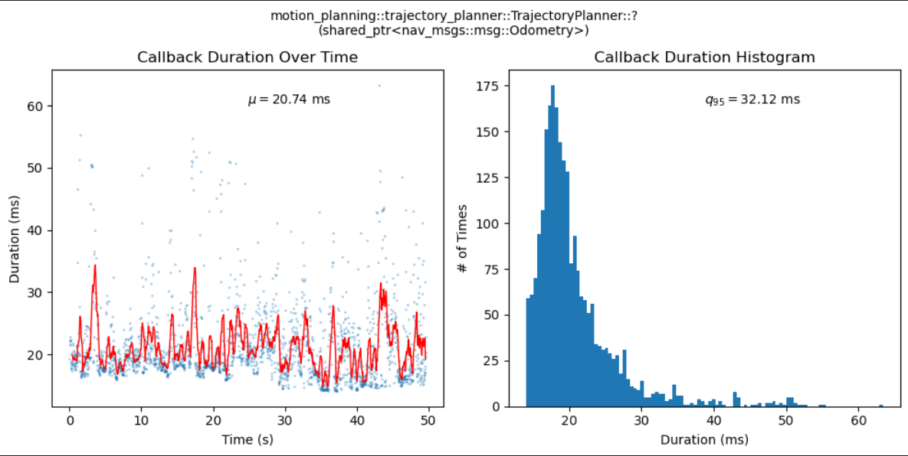

# ROS 2 Tracing C++

ROS 2 Tracing C++ is a custom plugin for babeltrace2 which replaces ROS 2 Tracing for analyzing ROS 2 C++ nodes.

<p align="center">
        
</p>
<p align="center">
        Callback execution time plot generated using ROS 2 Tracing C++
</p>

## Table of Contents

- [Introduction](#introduction)
- [Alternatives to ROS 2 Tracing C++](#alternatives-to-ros-2-tracing-c)
- [Supported Analysis Sinks](#supported-analysis-sinks)
- [Running ROS 2 Tracing C++](#running-ros-2-tracing-c)
- [Analyzing Processed Traces in a Jupyter Notebook](#analyzing-processed-traces-in-a-jupyter-notebook)
- [Installation Guide](#installation-guide)
  - [LTTNG Installation](#lttng-and-babeltrace-2-installation)
  - [ROS 2 TraceTools Launch Installation](#ros-2-tracetools-launch-installation)
  - [ROS 2 Tracing C++ Installation](#ros-2-tracing-c-installation)
- [Building from Source](#building-from-source)
  - [Babeltrace 2 from Source](#babeltrace-2-from-source)
  - [ROS 2 Tracing C++ from Source](#ros-2-tracing-c-from-source)
- [Collecting Traces with ROS 2 TraceTools Launch](#collecting-traces-with-ros-2-tracetools-launch)
- [Sink Output Data Schema](#sink-output-data-schema)
  - [Callback Duration Products](#callback-duration-products)
  - [Memory Usage Products](#memory-usage-products)
- [Improving Trace Processing Time](#improving-trace-processing-time)
- [Resources](#resources)

## Introduction

Trace analysis is incredibly powerful. However, processing traces with ROS 2 tracing took quite a bit longer than program execution times themselves. As a result, I wrote a custom C++ babeltrace2 plugin which uses the same mechanism of analyzing tracing but with much greater performance. As a rule of thumb, speedups of between **25x and 50x** can be expected. This enables real-time trace processing. 

<p align="center">
        
</p>
<p align="center">
        Processing times of 2 minutes of real-time trace collection on the Cavalier Autonomous Racing stack. A speedup of 52.1x and 20.9x is achieved for the memory usage and callback duration calculator, respectively.
</p>

## Alternatives to ROS 2 Tracing C++

There exist other trace analysis solutions for ROS 2

- [ROS 2 tracing analysis](https://github.com/ros-tracing/tracetools_analysis/tree/humble) is a good choice if you do not need high-performance trace analysis.
- [LTTNG Analyses](https://github.com/lttng/lttng-analyses) have good examples of trace-analysis scripts written in Python if you are looking to learn more about what you can get from trace-analysis.

> [!IMPORTANT]
> ROS 2 Tracing and the associated tooling is quite good. Consider analyzing traces with that first as it is quick to get started. If your traces process in a reasonable amount of time, you likely do not need to use this package.

## Supported Analysis Sinks

The supported features are inspired by the [ROS 2 tracing analysis](https://github.com/ros-tracing/tracetools_analysis/tree/humble) package.

| Plugin | Required Tracepoints | Description |
| :----- | :------------------- | :---------- |
| `sink.ros2_tracing_cpp.callback_duration` | `ros2:rclcpp_callback_register`, `ros2:callback_start`, `ros2:callback_end` | Collects the duration of each callback triggered |
| `sink.ros2_tracing_cpp.memory_usage` | `lttng_ust_libc:malloc`, `lttng_ust_libc:calloc`, `lttng_ust_libc:realloc`, `lttng_ust_libc:memalign`, `lttng_ust_libc:posix_memalign`, `lttng_ust_libc:free` | Gets information about the lifecycle of objects allocated by nodes |

## Running ROS 2 Tracing C++

To run the plugin, use `babeltrace2` with the specified plugin path and your tracing session output path.

```bash
babeltrace2 --plugin-path . ~/.ros/tracing/ros2_tracing_session/ --component=sink.ros2_tracing_cpp.memory_usage
```

After the trace has been fully processed, a metadata file will be produced for the run and a set of CSV files containing the processed traces. For more information about the format of produced files, see the [Sink Output Data Schema](#sink-output-data-schema) section.

## Analyzing Processed Traces in a Jupyter Notebook

For each sink, there is a pre-built Jupyter notebook which makes a standard set of plots per node. These analyses are designed to be extensible and a good starting point for any future work.

| Plugin | Jupyter Notebook |
| :----- | :--------------- |
| `sink.ros2_tracing_cpp.callback_duration` | [process_callback_duration.ipynb](./scripts/process_callback_duration.ipynb) |
| `sink.ros2_tracing_cpp.memory_usage` | [process_callback_duration.ipynb](./scripts/process_memory_usage.ipynb) |


## Installation Guide

To use ROS 2 Tracing C++, you must first:

1. install [Linux Trace Toolkit: next generation (LTTNG)](https://lttng.org/docs/) and [Babeltrace 2](https://babeltrace.org/#bt2-get)
2. install ROS 2 Tracetools Launch and rebuild your code
3. download and move the plugin from the releases page

### LTTNG and Babeltrace 2 Installation

Install LTTNG and Babeltrace 2 from [the stable Linux PPA package](lttng.org/docs/v2.13/#doc-ubuntu-ppa):

```bash
sudo apt-add-repository ppa:lttng/stable-2.13
sudo apt-get update
sudo apt install -y lttng-tools lttng-modules-dkms liblttng-ust-dev
sudo apt install -y babeltrace2
```

### ROS 2 TraceTools Launch Installation

Installing tracetools requires `apt` installing the `tracetools-launch` package and then sourcing the tracetools package **before** building any of the other packages which should be instrumented.

```bash
sudo apt install ros-humble-tracetools-launch
(cd external && git clone https://github.com/ros2/ros2_tracing && cd ros2_tracing && git checkout humble)
colcon build --packages-up-to tracetools
source install/setup.sh
```

After this, you can build your packages with `colcon` like normal. 

> [!WARNING]
> However, you must `source install/setup.sh` before building any of the other packages you want tracepoints enabled in. This is **atypical** for a ROS 2 project but is a valid workaround to building with tracepoints enabled while not requiring a from-source ROS build.

### ROS 2 Tracing C++ Installation

If you are running on a x86 system, you can [download the latest release binary](https://github.com/wkaisertexas/ros2_tracing_cpp/releases/latest) from the GitHub release.

```bash
wget https://github.com/wkaisertexas/ros2_tracing_cpp/releases/download/v1/libros2_tracing_cpp.so
mkdir -p /usr/local/lib/babeltrace2/plugins
sudo cp libros2_tracing_cpp.so /usr/local/lib/babeltrace2/plugins
```

> [!NOTE]
> Moving `libros2_tracing_cpp.so` into `/usr/local/lib/babeltrace2/plugins` is not required. However, this allows these trace analysis sinks to be used **without** specifying the `--plugin-path`

## Building from Source

Building ROS 2 Tracing C++ from source requires:

1. build `babeltrace2` from source
2. build the plugin `libros2_tracing_cpp.so`

### Babeltrace 2 from Source

To build a plugin, building from source is required ([see guide](https://babeltrace.org/docs/v2.0/libbabeltrace2/guide-build-bt2-dev.html)). This assumes you have a `.gitignore`-d directory named `external` for non-source packages.

```bash
# downloading and extracting babeltrace2
mkdir -p external
cd external
curl https://www.efficios.com/files/babeltrace/babeltrace2-2.0.6.tar.bz2 -o babeltrace.tar.bz2
tar -xvf babeltrace.tar.bz2
cd babeltrace2-*/

# building an installing from source
BABELTRACE_DEV_MODE=1 BABELTRACE_MINIMAL_LOG_LEVEL=TRACE ./configure --disable-debug-info
make -j$(nproc)
sudo make install
cd ../..
```

After that, `babeltrace2` will be built from source and installed.

### ROS 2 Tracing C++ from Source

To build the ROS 2 Tracing C++ plugin from source, run:

```bash
git clone https://github.com/wkaisertexas/ros2_tracing_cpp
cd ros2_tracing_cpp

mkdir build
cd build
cmake ..
make -j$(nproc)
sudo make install
```

At this point, the plugin will be built in `build/plugins/libros2_tracing_cpp.so` where you can reference the different sinks to process your traces.

## Collecting Traces with ROS 2 TraceTools Launch

With `tracetools-launch` installed, you can add the following to your launch file to collect traces.

```python
from launch import LaunchDescription

from tracetools_launch.action import Trace

CALLBACK_TRACEPOINTS = set(["ros2:rclcpp_callback_register", "ros2:callback_start", "ros2:callback_end"])
"""Tracepoints required for callback duration analysis"""
MEMORY_TRACEPOINTS = set(["lttng_ust_libc:malloc", "lttng_ust_libc:calloc", "lttng_ust_libc:realloc", "lttng_ust_libc:memalign", "lttng_ust_libc:posix_memalign", "lttng_ust_libc:free"])
"""Tracepoints required for memory usage analysis"""

def generate_launch_description() -> LaunchDescription:
    tracepoints_to_collect = CALLBACK_TRACEPOINTS | MEMORY_TRACEPOINTS
    trace_session = Trace(
        session_name="callback_duration_and_memory_usage",
        events_ust=list(tracepoints_to_collect),
        base_path="~/.ros/tracing", # default trace location
    )

    # the rest of your launch file

    return LaunchDescription([
        trace_session,
        # your nodes and parameteres
    ])
```

This launch command will create `~/.ros/tracing/callback_duration_and_memory_usage` which contains several nested folders. Running `babeltrace2 ~/.ros/tracing/callback_duration_and_memory_usage | less` will print out traces.

## Sink Output Data Schema

In this section, notes and helpful tips to process outputs generated by each plugin is included.

### Callback Duration Products

For files produced by `callback_duration`, a `callback_duration_metadata.csv` file which contains links and metadata to `callback_*.csv` files is produced. A script called [`scripts/process_callback_duration.ipynb`](./scripts/process_callback_duration.ipynb) makes callback duration plots using the collected traces.

| Column | Description |
| :----- | :---------- |
| `symbol` | The raw callback symbol monitored |
| `procname` | Process name of collected callback | 
| `address`  | The address of the selected callback, used as a pseudo-identifier |
| `count` | the number of times the callback was called |
| `path` | the relative path of the file containing the callback |
| `avg_duration` | the average duration of the callback (useful for crude filtering) |

The file contained in the path variable is a CSV file. The first two rows are the `symbol` and the `procname`. Then the file has the following columns:

| Column | Description |
| :----- | :---------- |
| `time`   | time in nanoseconds since the unix epoch that the callback occurred |
| `duration` | the duration of the callback in nanoseconds |

> [!TIP]
> If you are processing this in Pandas, you can use `pd.read_csv(path, skiprows=2)` to ignore the header

### Memory Usage Products

Files produced by `memory_usage`, you get a `memory_usage_metadata.csv` file which contains links and metadata to `mem_*.csv` files. A script called [`scripts/process_memory_usage.ipynb`](./scripts/process_memory_usage.ipynb) makes a 2x2 grid of plots examining allocations over time and the relative frequency of allocations of differing sizes.

| Columns | Description |
| :------ | :---------- |
| `path`    | the relative path to the `.csv` file containing the allocation information |
| `vpid`    | the virtual pid of the ros2 node |
| `procname` | process name making the allocation |
| `avg_alloc_lifecycle` | the average lifecycle of allocated objects |
| `avg_alloc_size` | the average allocation size |
| `allocation_count` | the total number of allocations |
| `max_process_memory` | the maximum amount of process memory |

The file contained in the `path` variable is a CSV file containing the following information:

| Columns | Description |
| :------ | :---------- |
| `type`  | The type of the allocation either `malloc`, `calloc`, `realloc`, `memalign` or `posix_memalign` |
| `time`  | The time in nanoseconds since the unix epoch the object was allocated |
| `duration` | How long the memory stuck around. A nan value means that the object was not freed |
| `prev_size` | The previous allocation size in bytes (only for realloc) |
| `size` | The size of the allocation in bytes |
| `vtid` | The virtual thread id which called the allocator | 

## Improving Trace Processing Time

Looking at a profile of this plugin, iterating through the traces with babeltrace2 takes **over 85% of total time**. Collecting the minimal set of events required for each plugin is the single-greatest tactic for reducing program execution time.


> [!IMPORTANT]
> To speed up processing time, consider using a live session created with `llttng create my-session --live` and `babeltrace2 --plugin-path . --input-format=lttng-live net://localhost/host/localhost/my-session --component=sink.ros2_tracing_cpp.memory_usage`

## Resources

1. [Babeltrace 2 Sink Example](https://babeltrace.org/docs/v2.0/libbabeltrace2/example-simple-sink-cmp-cls.html)
2. [ROS 2 Trace Analysis](https://github.com/ros-tracing/tracetools_analysis/tree/humble)
3. [LTTNG Documentation](https://lttng.org/docs/v2.13/)
4. [ROS 2 Tracing Whitepaper](https://arxiv.org/abs/2201.00393)
5. [ROS 2 Tracing Overhead Evaluation](https://github.com/christophebedard/ros2_tracing-overhead-evaluation)
6. [ROS 2 Tracing GitHub](https://github.com/ros2/ros2_tracing/tree/humble)

> [!NOTE]
> If you liked this repository, please consider giving it a star!
